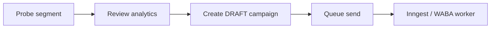

# Playbook: WhatsApp campaign (probe → draft → queue)

## When to use

Marketing/retention bulk message to a **segment** — not hardcoded member lists.

## Flow

## API

| Method | Path | Action |
|--------|------|--------|
| POST | `/api/campaigns/probe` | `{ segment }` → audience + analytics |
| POST | `/api/campaigns` | create draft with message + segment |
| POST | `/api/campaigns/[id]/send` | status → `QUEUED` |
| GET | `/api/campaigns` | list campaigns for gym |

## Segments

Defined once in `domains/campaigns/service.ts`:

- `expiring_this_week`
- `overdue`
- `lapsed_30d`
- `all_active`

Add new segments in domain service + Zod enum — not new dashboard pages per cohort.

## Prisma

`WhatsAppCampaign`: `message`, `segment` (JSON), `analytics` (JSON), `status` (`DRAFT` | `QUEUED` | …), `recipientCount`.

## UI (`/dashboard/campaigns`)

One page: segment select → Probe → analytics card → name/message → Create → Queue on row.

## Send implementation

Queue sets status; actual send belongs in Inngest/WhatsApp domain — same adapter as bills/reminders (`meta-waba-adapter`).

Log each send to `WhatsAppSendLog` for `/dashboard/wa-history`.

## Forbidden

- OpenWA UI
- Per-campaign static routes (`/reminders/feb-cohort`)
- Probe without `gymId`
